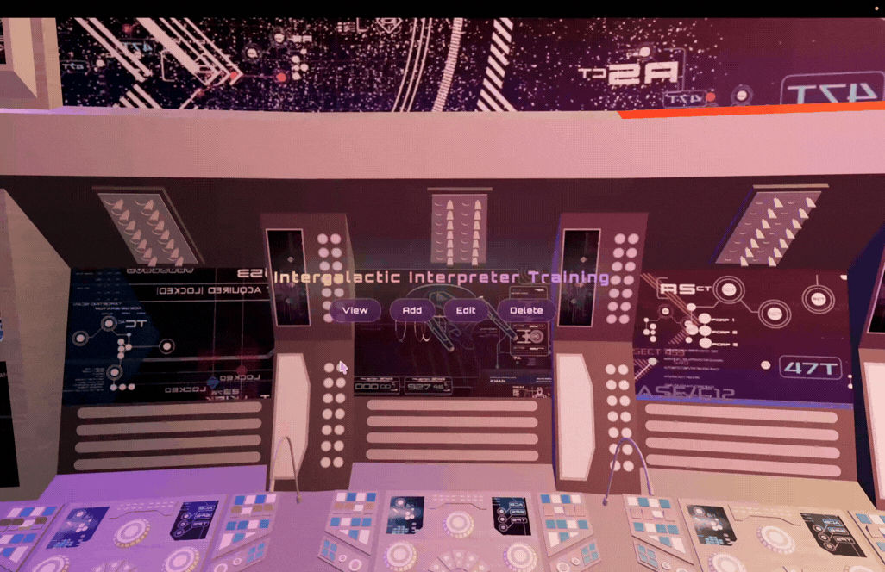
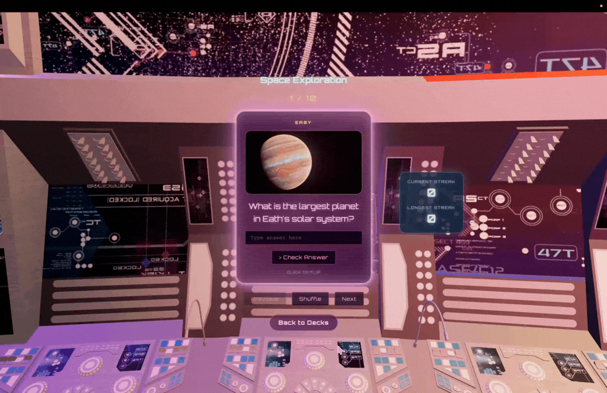

# Web Development Project 2 - *Intergalactic Interpreter Trainer - Flashcard App*

Submitted by: **Daphne Blum**

This web app: **An interactive flashcard application set aboard a futuristic spaceship bridge. Users can select a deck, flip cards to reveal answers, view accompanying images, and navigate through a randomized set of flashcards. The experience is presented through a custom sci-fi interface built with React Three Fiber and a fully integrated 3D environment.**

Time spent on part 1: **15** hours
Time spent on part 2: **6** hours
Time spent: **21** hours spent in total

## Required Features

The following **required** functionality is completed:

- [x] **The user can enter their guess into an input box *before* seeing the flipside of the card**
  - Application features a clearly labeled input box with a submit button where users can type in a guess
  - Clicking on the submit button with an **incorrect** answer shows visual feedback that it is wrong 
  -  Clicking on the submit button with a **correct** answer shows visual feedback that it is correct
- [x] **The user can navigate through an ordered list of cardss**
  - A forward/next button displayed on the card navigates to the next card in a set sequence when clicked
  - A previous/back button displayed on the card returns to the previous card in the set sequence when clicked
  - Both the next and back buttons should have some visual indication that the user is at the beginning or end of the list (for example, graying out and no longer being available to click), not allowing for wrap-around navigation

The following **optional** features are implemented:

- [x] Users can use a shuffle button to randomize the order of the cards
  - Cards should remain in the same sequence (**NOT** randomized) unless the shuffle button is clicked 
  - Cards should change to a random sequence once the shuffle button is clicked
- [x] A user’s answer may be counted as correct even when it is slightly different from the target answer
  - Answers are considered correct even if they only partially match the answer on the card 
  - Function is made to ignore particles in answer
- [x] A counter displays the user’s current and longest streak of correct responses
  - The current counter increments when a user guesses an answer correctly
  - The current counter resets to 0 when a user guesses an answer incorrectly
  - A separate counter tracks the longest streak, updating if the value of the current streak counter exceeds the value of the longest streak counter 
- [ ] A user can mark a card that they have mastered and have it removed from the pool of displayed cards
  - The user can mark a card to indicate that it has been mastered
  - Mastered cards are removed from the pool of displayed cards and added to a list of mastered cards

The following **additional** features are implemented:

* [x]  Fully integrated 3D spaceship bridge environment using React Three Fiber
* [x]  Custom holographic card design with glow effects and sci-fi styling
* [x]  Quiz progress tracker displaying current card number
* [x]  Main menu screen with placeholder navigation for future Add/Edit/Delete deck management features
* [x]  Navigation system for returning to deck selection
* [x]Users can manually contest an auto-graded answer (flip a Correct/Incorrect     result if they believe the auto-grader made a mistake), which correctly adjusts the score and streak counters

## Video Walkthrough

Here's a walkthrough of implemented required features for part 1:

Here's a walkthrough of implemented required features for part 2:

GIFs created with   
Canva

## Notes

One of the biggest challenges was integrating a traditional flashcard application into a fully interactive 3D environment using React Three Fiber. Positioning the interface within the spaceship bridge, balancing scene lighting, and creating a sci-fi aesthetic required significant experimentation with CSS effects, camera placement, and Three.js rendering. Another challenge was ensuring that card interactions, randomized card selection, and score tracking continued to work correctly while layering React UI components over a 3D scene. Another difficulty was deciding how far to go with the "contest" feature's effect on the longest streak: fully reversing a longest-streak update after a contested answer would require storing a history of every streak change rather than just its current value, which felt like more complexity than the feature warranted given the timeline. Instead, the longest streak is treated as a record of the best the user has legitimately demonstrated — contesting an answer can still correct the current streak and score going forward, but a longest-streak milestone, once reached, stays recorded even if a later answer that contributed to it is corrected.

## License

    Copyright 2026 Daphne Blum

    "U.S.S. Enterprise A New Bridge" (https://skfb.ly/pBHEs) by Cpt.Kirk is licensed under Creative Commons Attribution (http://creativecommons.org/licenses/by/4.0/).

    Licensed under the Apache License, Version 2.0 (the "License");
    you may not use this file except in compliance with the License.
    You may obtain a copy of the License at

        http://www.apache.org/licenses/LICENSE-2.0

    Unless required by applicable law or agreed to in writing, software
    distributed under the License is distributed on an "AS IS" BASIS,
    WITHOUT WARRANTIES OR CONDITIONS OF ANY KIND, either express or implied.
    See the License for the specific language governing permissions and
    limitations under the License.